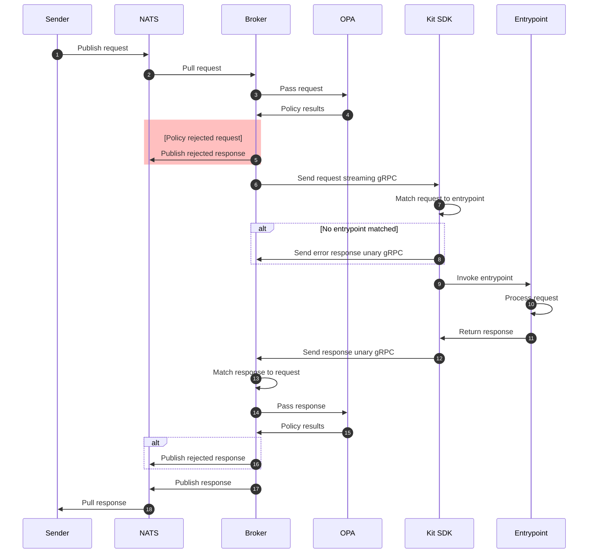

This is some stuff. [asds](asdf)

```mermaid
sequenceDiagram
  autonumber
  Sender->>NATS: Publish request
  NATS->>Broker: Pull request
  Broker->>OPA: Pass request
  OPA->>Broker: Policy results
  rect rgba(255, 0, 0, 0.25)
    Broker->>NATS: [Policy rejected request]<br><br>Publish rejected response
  end
  Broker->>Kit SDK: Send request streaming gRPC
  Kit SDK->>Kit SDK: Match request to entrypoint
  alt No entrypoint matched
    Kit SDK->>Broker: Send error response unary gRPC
  end
  Kit SDK->>Entrypoint: Invoke entrypoint
    Entrypoint->>Entrypoint: Process request
    Entrypoint->>Kit SDK: Return response
    Kit SDK->>Broker: Send response unary gRPC
  Broker->>Broker: Match response to request
  Broker->>OPA: Pass response
  OPA->>Broker: Policy results
  alt
    Broker->>NATS: Publish rejected response
  end
  Broker->>NATS: Publish response
  NATS->>Sender: Pull response
```
