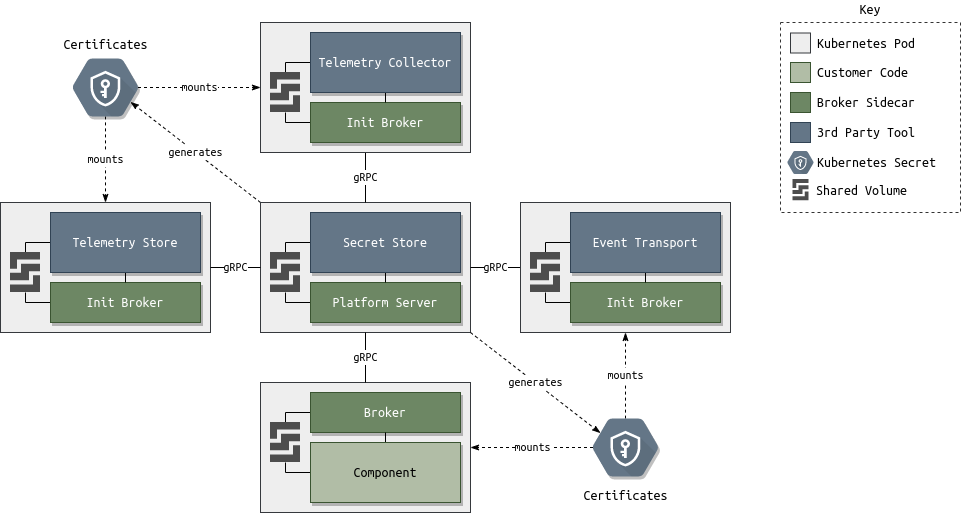

# Bootstrap

> Add details

## Vault/KubeFox Controller

The actor in the following statements is the KubeFox Controller unless other specified. Vault API will be limited to `localhost` access. The KubeFox Controller will run as a sidecar to Vault allowing it to communicate via `localhost`. The KubeFox Controller is abbreviated KFC.

- Check if Pod is StatefulSet 0
- Check if Vault has been initialized.
  - No
    - Initialize Vault.
    - Generate AES key and write to K8s Secret.
    - Encrypt Vault key with AES key and write to disk.
    - Use root token to setup K8s auth method.
    - Use root token to create K8s auth role for the KFC.
    - Revoke root token.
  - Yes
    - Ensure K8s Secret containing AES key is mounted, if not fatal error.
    - Ensure encrypted Vault key is present on disk, if not fatal error.
    - Use AES key to decrypt Vault key.
    - Use Vault key to unseal Vault.
- Exchange the pod's K8s Service Account token for Vault token.
- Setup various Vault secrets engines.
  - K/V for Systems and related resources
  - K/V for Environments
  - ElasticSearch (OpenSearch)
  - PKI (Certificates), create root certificate, vault stores private key
  - NATS
- Write various roles to Vault secret engines.
- Retrieve certificate, CA certificate, and private key from Vault PKI secret engine.
- Write certificate and CA certificate to K8s Secret.
- Start gRPC server using certificate and private key. The server is used by other services to bootstrap.

## NATS

The actor in the following statements is the KubeFox NATS initializer unless other specified. The KubeFox NATS initializer runs as an init container for the NATS pod and writes the configuration from the bootstrapping process to a shared volume that is utilized by NATS. The KubeFox Controller is abbreviated KFC.

- Check if KFC certificate and CA certificate are properly mounted from K8s Secret, if not fatal error.
- Use KFC certificates to connect to KFC's gRPC server.
- Send a `NATSBootstrapRequest` containing the pod's K8s Service Account token to KFC.
- KFC performs the following:
  - Exchange K8s Service Account token from bootstrap request for Vault token.
  - Retrieve Operator JWT from Vault NATS secret engine. The JWT will contain the system account.
  - Return the Operator JWT to the KubeFox NATS initializer.
- Write a NATS config file containing the Operator JWT to shared volume and exit.
- NATS container starts, reading config file from shared volume.

## OpenSearch

- Telemetry collector needs access (write only?)
- Create readonly access account for "viewer" role
- Create admin password
- bootstrap init container
  - calls controller rpc, gets back certs, admin password, telemetry collector password
  - generates opensearch config, writes to shared volume
- opensearch starts and reads config from shared volume

- https://opensearch.org/docs/latest/security-plugin/configuration/yaml/

## Component

The actor in the following statements is the KubeFox Broker sidecar unless other specified. The KubeFox Controller is abbreviated KFC.

- Check if KFC certificate and CA certificate are properly mounted from K8s Secret, if not fatal error.
- Use KFC certificates to connect to KFC's gRPC server.
- Send a `ComponentBootstrapRequest` containing the pod's K8s Service Account token to KFC.
- KFC performs the following:
  - Exchange K8s Service Account token from bootstrap request for Vault token.
  - Retrieve User JWT and signed nonce from Vault NATS secret engine.
  - Retrieve certificate, CA certificate, and private key from PKI secret engine.
  - Return the User JWT, signed nonce, certificates, and private key to the KubeFox Broker.
- Use User JWT and signed nonce to connect to NATS.
- Start gRPC server using certificate and private key.
- Write certificates to shared volume.
- Runtime connects to Broker's gRPC using certificates from shared volume.

> TODO Add request time jwt request workflow

## Telemetry

- secure connection to collector from fluentbit and tracers