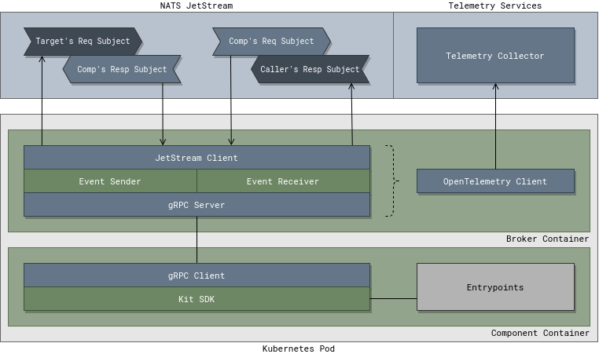
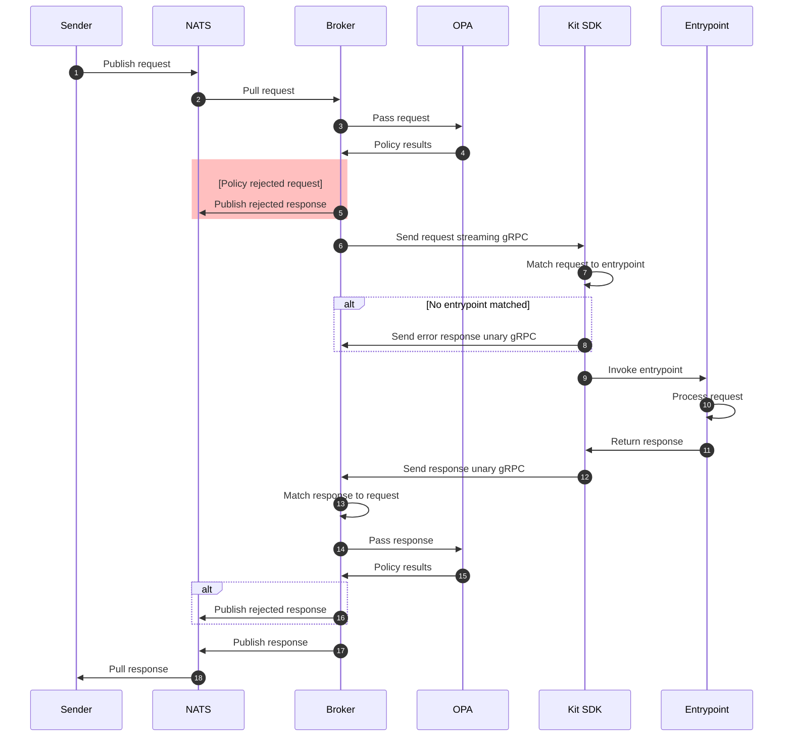

# Broker

## Overview

## Workflows

### Startup

### Inbound Request Workflow

1. `Sender` triggers a request by placing a request message on `Receiver's` `NATS` request subject. `Sender` include its app name, instance ID, and the response subject name in the request.
2. The `Receiver's` `broker` pulls the request from `NATS`.
3. The request is passed the `OPA` library which executes the component's Rego policies against it.
4. `OPA` returns the results of the policies, either accept or reject.
5. If the request is rejected a response of type `io.kubefox.rejected` is published to `NATS` on the response subject specified in the request.
6. If the request is accepted the `broker` adds the request to its lookup and then sends it to the runtime via the streaming gRPC connection that was made on startup.
7. The `Kit SDK` receives the request and attempts to match it to an entrypoint rule.
8. If the request does not match any entrypoint rules and a default entrypoint is not set, a response of type `io.kubefox.error` is sent to the `broker`.
9. If the request is matched the `Kit SDK` invokes the `entrypoint` with the request.
10. The `entrypoint` processes the request.
11. A response is returned to the `Kit SDK` from the `entrypoint` invocation.
12. The response is updated with the requests metadata and sent to the `broker` by making a unary gRPC call.
13. Using the request metadata of the response the `broker` finds the matching request in its lookup.
14. The response is passed the `OPA` library which again executes the component's Rego policies against it.
15. If the response is rejected a response of type `io.kubefox.rejected` is published to `NATS` on the response subject specified in the request.
16. If the response is accepted it is published to `NATS` on the response subject specified in the request.
17. The `Sender` pulls the response for the specified subject.

### Outbound Request

### Metrics

### Traces
