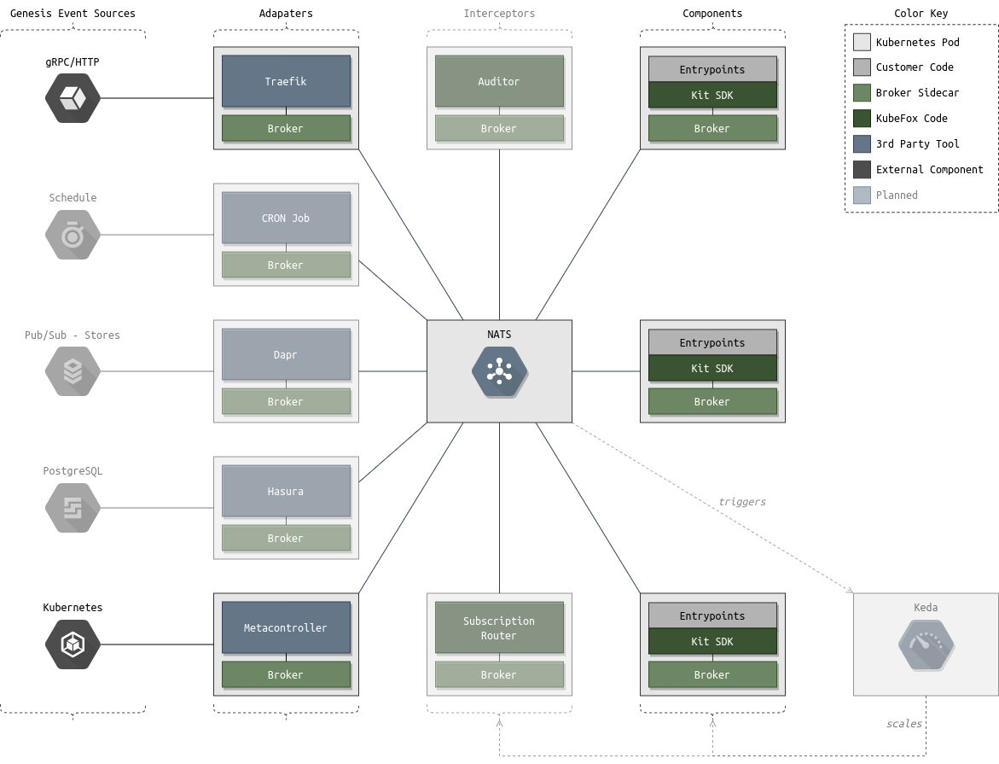

# Overview

Two or Three paragraphs describing what we do and why it matters

XigXog's focus is to simplify application development - and KubeFox is XigXog's first product.  KubeFox provides a simple infrastructure to enable the creation of sophisticated, robust, secure applications, and to provide versioning, environment management and rich telemetry out of the box.

KubeFox harmonizes 

