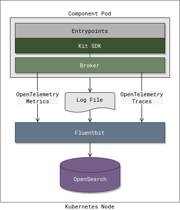

# Telemetry

## Infrastructure

## Metrics

To better secure components only the broker (not the runtime) exposes an HTTP endpoint that allows Prometheus to scrape metrics. The endpoint reports metrics for both the broker and runtime.

When Prometheus scrapes the HTTP endpoint of the broker it requests the runtime's metrics, combines them with its own metrics, adds the label `component_part`, and returns the combined metrics.

### Metrics Collection Process

1. Prometheus makes an HTTP call to the broker to scrape metrics.
2. The broker generates its metrics using the Prometheus library.
3. The broker sends a `MetricsRequest` to the runtime.
4. The runtime generates its metrics using the Prometheus library and sends a `MetricsResponse` to the broker.
5. The broker combines the metrics adding the labels `component_id`, `component_hash`, `component_name`, and `component_part` and serializes them to Prometheus' exposition format.
6. The combined metrics are returned to Prometheus.
