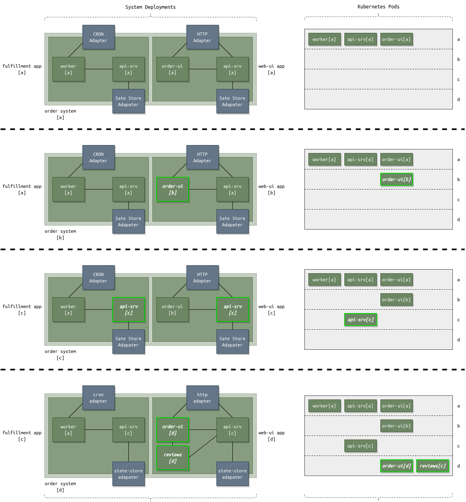

# Event Transport

## Access Control

apps:
    ful[a]:
        pub: [worker, api-srv]
        export: worker, api-srv
        export to: wor[a], api[a]
    web[a]:
        pub: [order-ui, api-srv]
        export: order-ui, api-srv
        export to: ord[a], api[a]
    ful[c]:
        pub: [worker, api-srv]
        export: worker, api-srv
        export to: wor[a], api[c]

components:
    wor[a]
        sub: wor.req, wor.resp
        pub: cron.req
        from: ful[a]
            import: worker[a], api-srv[a]
        from: ful[c]
            import: worker[a], api-srv[c]
    api[a]
        sub: api.req, api.resp
        pub: state-store.req
        from: ful[a]
            import: worker, api-srv
        from: web[a]
            import: order-ui, api-srv
    ord[a]
        pub/sub: http
        from: web[a]
            import: order-ui, api-srv

from account wor[a] create user wor[a]-123