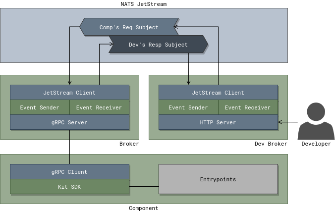

# Local Development

To simplify local development it is possible to start a local instance of a
broker in `dev` mode. When running in `dev` mode a broker does not require TLS
for it's gRPC connection, logs in plain text, and starts an HTTP server to
quickly send events to its managed component.

## Broker Dev Mode



## Walk Through

Setup vars, tweak as needed:

```bash
export SYSTEM_NAME=demo-system
export COMPONENT_NAME=go-backend
```

Checkout `broker` and `sdk-go` code:

```bash
mkdir -p ~/Workspace/src/github.com/xigxog/kubefox/
cd ~/Workspace/src/github.com/xigxog/kubefox/
git clone git@github.com:kubefox/broker.git
git clone git@github.com:kubefox/sdk-go.git
go work init ./sdk-go/ ./broker/
```

If working on a Go component and want to work on the Kit SDK at the same time
add it to the Go workspace:

```bash
mkdir -p ~/Workspace/src/github.com/xigxog/kubefox/
cd ~/Workspace/src/github.com/xigxog/kubefox/
git clone git@github.com:kubefox/$SYSTEM_NAME
go work use ./$SYSTEM_NAME/components/$COMPONENT_NAME/
```

Check if component is already running on the cluster:

```bash
kubectl get pod -n $SYSTEM_NAME -l "app.kubernetes.io/component=$COMPONENT_NAME"
```

If there is a component running scale `Deployment` to zero. This is to ensure
the component running on the cluster does not receive any messages generated
during development testing:

```bash
kubectl scale deployment -n $SYSTEM_NAME -l "app.kubernetes.io/component=$COMPONENT_NAME" --replicas 0
```

Port forward to NATS:

```bash
kubectl port-forward -n kubefox-system svc/kubefox-nats 4222:4222
```

Start up the local broker. It will connect to NATS via the port forward setup
above. Additionally it will start an HTTP server on port 8080. Requests sent to
this server will automatically route the event to the component using the
provided environment and app context.

```bash
cd ~/Workspace/src/github.com/xigxog/kubefox/broker
go run cmd/broker/main.go component \
    --dev \
    --dev-http-addr=localhost:8080 \
    --dev-env=dev \
    --dev-app=order-app \
    --component-name $COMPONENT_NAME
```

Start your local component:

```bash
cd ~/Workspace/src/github.com/xigxog/kubefox/$SYSTEM_NAME/components/$COMPONENT_NAME
go run main.go -dev
```

Send a message to component:

```bash
curl -v "http://localhost:8080/"
```
